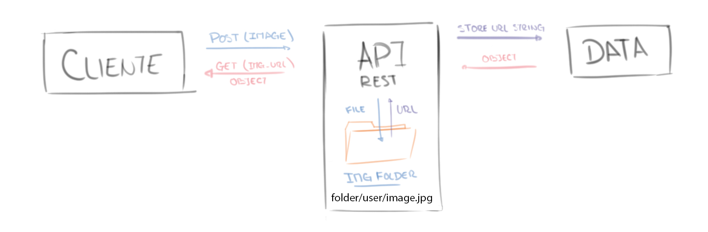

# **Personal Portfolio**
**Page:** https://uriel-spiridione.web.app/  
**API:** https://uspiri-backend.herokuapp.com/  
**FrontEnd:** https://github.com/USpiri/Portfolio_ArgPrograma/  
**BackEnd:** https://github.com/USpiri/Portfolio_ArgPrograma_Backend/  
**Backend without Image Managment:** https://github.com/USpiri/Portfolio_Backend_NoImage/  
**Preview:** https://uspiri.github.io/  
**Dev Journal:** https://github.com/USpiri/Portfolio_ArgPrograma/tree/master/Bit%C3%A1cora  
#

❗❗❗ **IMPORTANTE:** Este Backend **NO** implementa el Image Management explicado debajo, ya que Heroku no admite la escritura de archivos, por lo que para un Backend que administra las imagenes dirigirse a [***Backend***](https://github.com/USpiri/Portfolio_ArgPrograma_Backend/). Este utiliza conexion a una cuenta [***Cloudinary***](https://cloudinary.com/), por lo que es necesario un registro e una página extra ❗❗❗  

**Este es el Backend implementado en Heroku**

Este repositorio es parte de un proyecto **Full Stack**, este es la implementación de un BackEnd programado en Java con SpringBoot para el curso #YoProgramo de Argentina Programa implementando dependencias como Lombok, Spring DevTools, Spring Web, Spring Security, JWT, Spring Data JPA, MySQL Driver y Validation. Esta diseñado para administrar los datos y trabajar en conjunto con el [***Portfolio FrontEnd***](https://github.com/USpiri/Portfolio_ArgPrograma/), mandar mails y administrar las imagenes del sitio.  
El proyecto cuenta con 7 packages principales en donde cada uno se encarga de tareas especificas. El package ***Security*** tiene a su vez diferentes sub-packages para administrar su funcionamiento.  
También posee 10 Controllers necesarios para comunicarse con los diferentes componentes del Portfolio.  
Los datos de usuario para logearse, y mail ***desde*** el cual se envían los mails a la cuenta de *Person* se especifican en el archivo `application.properties`.  
El funcionamiento de todo el proyecto fue pensado para una rápida ejecución, sin la necesidad de registrarse en páginas de terceros, programas extra como PostMan y/o tener que introducir datos desde otro lado.  

+ Al ejecutar la API por **primera vez** se crea una Person y el User por defecto junto con sus Roles en la BBDD
+ Se encarga del almacenamiento y eliminado de imagenes compartiendo las url correspondientes con la BBDD
+ Manda emails desde un email especificado en **Application.properties**  

La creación de la Person vacía tiene dos moivos, ambos orientados a la experiencia de usuario brindandole la facilidad de ingresar al Front y modificar todo desde ahi y evitar tener que abrir otros programas o ejecutar las ordenes para agregar los datos en BBDD.

## **Getting Started with Portfolio BackEnd**  
#

Es posible descargar el repositorio desde Github, o clonado mediante:
`gh repo clone USpiri/Portfolio_ArgPrograma_Backend`.

## Configuración

Antes de ser ejcutado el BackEnd debe ser configurado, el archivo se encuentra en `src/main/resources/application.properties`. **Los campos que DEBEN ser editados** son:  

```yml
# Database Properties
spring.datasource.url = jdbc:mysql://localhost:3307/portfolio?useSSL=false&serverTimezone=UTC 
spring.datasource.username = root
spring.datasource.password = 
# MailSender Properties
spring.mail.username=YOUR-EMAIL
spring.mail.password=YOUR-EMAIL-APP-PASSWORD
# Security Properties
portfolio.app.jwt.expiration=3600
portfolio.app.jwt.secret=SECRETKEY
# Default admin user
portfolio.app.default.username=DEFAULT-USER-USERNAME
portfolio.app.default.password=DEFAULT-USER-PASSWORD
```  

En el primer "grupo" los daos referidos a la base de datos, como la url y las credenciales en caso de ser necesarias. Para el segundo grupo se debe ingresar un mail y la contraseña de applicación para ese mail (Más adelante se explica como obtener esta clave). El tercer grupo es opcional, hacen referencia a la duración del token al iniciar sesión en el Front y la semilla de generación de los mismos. Los ultimos dos campos (*"portfolio.app.default.username"* y *"portfolio.app.default.password"*) son las credenciales del usuario por defecto que crea el sistema. **Es IMPORTANTE modificar estos datos antes de ejecutar la aplicación**.  

## Conexión FrontEnd

Para mantener la seguridad de la api y evitar que se ejecuten métodos desde otras páginas y/o archivos JavaScript, es importatnte la implementacion de la annotation @Cross-Origin que es un concepto de seguridad para la restriccion al acceso de datos. Por lo tanto se vuelve necesaria la modificación de esta tag en cada uno de los controladores.  
La mayoría de los Controllers se encuentran en `src/main/java/com/portfolio/backenduspiri/controller`, excepto AuthController que se ubica en `src/main/java/com/portfolio/backenduspiri/security/controller`  

```java
@RestController
@RequestMapping("/person")
@CrossOrigin( origins = "http://localhost:4200" ) //  <<==FRONTEND URL HERE
public class PersonController {
    ...
}
```

# MailSender

El envío de mail se realiza con la dependencia JavaMailSender, esto requiere introducir un email y contraseña desde el cual se envian los mensajes. Para el email es posible utilizar uno diferente del propio de Person pero obligatoriamente **debe ser Gmail**

## Contraseña  

La contraseña **no puede ser la del mail**, se requiere de una app password (Contraseña para app), esta se consigue al abrir una nueva pestaña, presionando el usuario en:  
**`Administrar cuenta de Google > Seguridad > Contraseñas de aplicación`**  

# Image Management  

Las imágenes **no se guardan el BBDD**, en esta solo se almacena una url que lleva a la "carpeta publica" de la API en donde se encuentran almacenadas las imágenes. Esto evita tener que registrarse en páginas que brindan este tipo de servicios, por un lado, y por el otro evita almacenar variables muy grandes en BBDD como los ByteArray o base64.  

  

Ingresa un MultipartFile al controller que contiene la imagen y mediante FileUploadUtil el sistema se encarga de almacenarla en el directorio y devuelve una url como *apiURL/user-photos/1/projects/4.jpg* que apunta a la imágen del proyecto con ID = 4 de la persona con ID = 1 (A modo de ejemplo).  
El directorio se compone de la siguiente forma

```
user-photos   
│
└───{ Person.ID }
│   │
│   │   about.png
│   │   header.png
│   │
│   └───projects
│   │   │   { Project.ID }.jpg
│   │   │   ...
│   │
│   └───education
│   │   │   { Education.ID }.jpg
│   │   │   ...
│   │
│   └───experience
│       │   { Experience.ID }.jpg
│       │   ...
│    
└───{ Person.ID2 }
    │   about.png
    │   header.png
    ...
```  

# Cloudinary  

Las imágenes **no se guardan el BBDD**, en esta solo se almacena una url que lleva al link de Cloudinary en donde se encuentran almacenadas las imágenes. Esto evita evita almacenar variables muy grandes en BBDD como los ByteArray o base64.  

Para utilizar esta funcion es necesario agregar unas variables en *Application.properties*, el archivo se encuentra en `src/main/resources/application.properties`. **Los campos que DEBEN ser editados** son:  

```yml
# Cloudinary
cloud.key = CLOUDINARY-KEY
cloud.name = CLOUDINARY-CLOUD-NAME
cloud.secret = CLOUDINARY-SECRET
```  

Estos datos se obtienen luego del registro en [***Cloudinary***](https://cloudinary.com/), en la pestaña *Dashboard*

# Métodos
Las siguientes tablas describen cada uno de los diferentes controllers y las funciones de las que administran.

## EducationController

| **Methods** | **Urls**               | **Actions**                                                     |
|:-----------:|------------------------|-----------------------------------------------------------------|
| GET         | /education             | Devuelve una lista con todas las Education                      |
| GET         | /education/{id}        | Devuelve la Education.{id}                                      |
| GET         | /education/person/{person_id} | Devuelve una lista de Education pertenecientes a la Person.{id} |
| POST        | /education/{person_id} | Crea una nueva Education en la BBDD para la Person.{person_id}  |
| PUT         | /education/{id}        | Actualiza los datos de la Education.{id}                        |
| PUT         | /education/{id}/image  | Actualiza la imagen de la Education.{id}                        |
| DELETE      | /education/{id}        | Elimina la Education.{id}                                       |

## ExperienceController

| **Methods** | **Urls**               | **Actions**                                                     |
|:-----------:|------------------------|-----------------------------------------------------------------|
| GET         | /experience             | Devuelve una lista con todas las Experience                     |
| GET         | /experience/{id}        | Devuelve la Experience.{id}                                     |
| GET         | /experience/person/{person_id} | Devuelve una lista de Experience pertenecientes a la Person.{id} |
| POST        | /experience/{person_id} | Crea una nueva Experience en la BBDD para la Person.{person_id}  |
| PUT         | /experience/{id}        | Actualiza los datos de la Experience.{id}                        |
| PUT         | /experience/{id}/image  | Actualiza la imagen de la Experience.{id}                        |
| DELETE      | /experience/{id}        | Elimina la Education.{id}                                       |
  
## ImageController

| **Methods** | **Urls**               | **Actions**                                                     |
|:-----------:|------------------------|-----------------------------------------------------------------|
| GET         | /image             | Devuelve una lista con todas las Image                      |
| GET         | /image/{id}        | Devuelve la Image.{id}                                      |
| GET         | /image/person/{person_id} | Devuelve la Image pertenecientes a la Person.{id} |
| POST        | /image/{person_id} | Crea una nueva Image en la BBDD para la Person.{person_id}  |
| PUT         | /image/{id}        | Actualiza los datos de la Image.{id}                        |
| PUT         | /image/{id}/header | Actualiza los datos de la Image.{id}.header                        |
| PUT         | /image/{id}/about | Actualiza los datos de la Image.{id}.about                        |
| DELETE      | /image/{id}        | Elimina la Image.{id}                                       |

## JobTypeController

| **Methods** | **Urls**      | **Actions**                              |
|:-----------:|---------------|------------------------------------------|
| GET         | /jobtype      | Devuelve una lista con todas las JobType |
| GET         | /jobtype/{id} | Devuelve la JobType.{id}                 |
| POST        | /jobtype      | Crea una nueva JobType en la BBDD        |
| PUT         | /jobtype/{id} | Actualiza los datos de la JobType.{id}   |
| DELETE      | /jobtype/{id} | Elimina la JobType.{id}                  |

## PersonController

| **Methods** | **Urls**     | **Actions**                             |
|:-----------:|--------------|-----------------------------------------|
| GET         | /person      | Devuelve una lista con todas las Person |
| GET         | /person/{id} | Devuelve la Person.{id}                 |
| POST        | /person      | Crea una nueva Person en la BBDD        |
| PUT         | /person/{id} | Actualiza los datos de la Person.{id}   |
| DELETE      | /person/{id} | Elimina la Person.{id}                  |

## ProjectController

| **Methods** | **Urls**                    | **Actions**                                                     |
|:-----------:|-----------------------------|-----------------------------------------------------------------|
| GET         | /project                    | Devuelve una lista con todas las Project                        |
| GET         | /project/{id}               | Devuelve la Project.{id}                                        |
| GET         | /project/person/{person_id} | Devuelve una lista de Project pertenecientes a la Person.{id}   |
| POST        | /project/{person_id}        | Crea una nueva Project en la BBDD para la Person.{person_id}    |
| PUT         | /project/{id}               | Actualiza los datos de la Project.{id}                          |
| PUT         | /project/{id}/image         | Actualiza la imagen de la Project.{id}                          |
| DELETE      | /project/{id}               | Elimina la Project.{id}                                         |

## SkillController

| **Methods** | **Urls**                  | **Actions**                                                     |
|:-----------:|---------------------------|-----------------------------------------------------------------|
| GET         | /skill                    | Devuelve una lista con todas las Skill                          |
| GET         | /skill/{id}               | Devuelve la Skill.{id}                                          |
| GET         | /skill/person/{person_id} | Devuelve una lista de Skill pertenecientes a la Person.{id}     |
| POST        | /skill/{person_id}        | Crea una nueva Skill en la BBDD para la Person.{person_id}      |
| PUT         | /skill/{id}               | Actualiza los datos de la Skill.{id}                            |
| PUT         | /skill/{id}/image         | Actualiza la imagen de la Skill.{id}                            |
| DELETE      | /skill/{id}               | Elimina la Skill.{id}                                           |

## SocialMediaController

| **Methods** | **Urls**                   | **Actions**                                                      |
|:-----------:|----------------------------|------------------------------------------------------------------|
| GET         | /social                    | Devuelve una lista con todas las SocialMedia                     |
| GET         | /social/{id}               | Devuelve la SocialMedia.{id}                                     |
| GET         | /social/person/{person_id} | Devuelve la SocialMedia pertenecientes a la Person.{id}          |
| POST        | /social/{person_id}        | Crea una nueva SocialMedia en la BBDD para la Person.{person_id} |
| PUT         | /social/{id}               | Actualiza los datos de la SocialMedia.{id}                       |
| DELETE      | /social/{id}               | Elimina la Education.{id}                                        |

## EmailController

| **Methods** | **Urls**                | **Actions**                                                                                |
|:-----------:|-------------------------|--------------------------------------------------------------------------------------------|
| POST        | /{person_id}/send-email | Envia un mail a Person.{person_id}.email desde el mail indicado en Application.properties  |

## AuthController

| **Methods** | **Urls**               | **Actions**                                                     |
|:-----------:|------------------------|-----------------------------------------------------------------|
| POST        | /auth/singup           | Crea un nuevo User                                              |
| POST        | /auth/login            | Devuelve las credenciales y el Token       